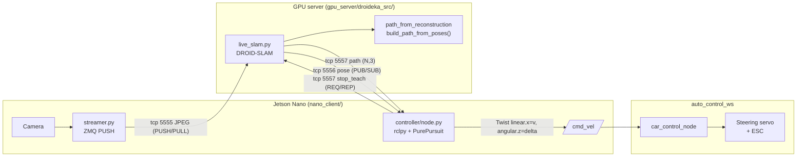

# droideka — Autonomous RC Car with DROID-SLAM + Pure Pursuit

Independent laboratory project: an Ackermann-steered RC car that **records a
reference path while driven manually**, then **follows that path autonomously**
using DROID-SLAM for visual localisation and Pure Pursuit for path tracking.

The system is split into two compute nodes communicating over ZeroMQ, plus a
separate ROS 2 workspace that owns the low-level vehicle control:

| Node                  | Hardware            | Role                                                       |
|-----------------------|---------------------|------------------------------------------------------------|
| Nano client           | NVIDIA Jetson Nano  | Camera streaming + Pure Pursuit + ROS 2 `/cmd_vel` publish |
| GPU server            | Linux + CUDA GPU    | DROID-SLAM, path construction, live pose publishing        |
| `auto_control_ws`     | Same Nano / ROS 2   | Subscribes `/cmd_vel`, drives steering + ESC               |

`auto_control_ws` is maintained separately at
[krisztiancsuta/auto\_control\_ws](https://github.com/krisztiancsuta/auto_control_ws);
this repo only emits the `geometry_msgs/msg/Twist` it expects on `/cmd_vel`.

## Hardware

- **Camera**: Intel RealSense D435i (RGB used for SLAM; depth/IMU available
  for future emergency-brake work).
- **Vehicle**: [HPI Trophy Buggy Flux #107016](https://www.hpiracing.com/en/kit/107016) —
  1/8-scale 4WD electric buggy, 320 mm wheelbase, max steering ±30°
  (defaults in
  [`nano_client/controller/config.py`](nano_client/controller/config.py)
  match these specs). Camera mounted 200 mm behind the front axle
  (≈0.12 m ahead of the rear axle — see `CAMERA_OFFSET_FORWARD_M` in
  [`gpu_server/droideka_src/pure_pursuit.py`](gpu_server/droideka_src/pure_pursuit.py)).
- **Compute**:
  - **Client**: Jetson Nano (camera capture, light pre-processing, ROS 2 node).
  - **Server**: x86 Linux box with NVIDIA GPU running DROID-SLAM
    (PyTorch + CUDA + `lietorch`).

## Architecture



The GPU runs a **single continuous SLAM session** that flips between two
states:

| State        | Behaviour                                                                        |
|--------------|----------------------------------------------------------------------------------|
| `TEACH`      | Track + buffer keyframes from the JPEG stream. Default startup state.            |
| `AUTONOMOUS` | Keep tracking and publish the latest rear-axle pose on every successful `track`. |

`stop_teach` is the one-shot transition: it triggers in-process path
construction (dedupe + smoothing over `droid.video.poses[:counter]`), replies
with the path, and flips the state to `AUTONOMOUS`. No two-phase
re-localisation — the world frame is preserved within the single session.

## Frame & units

- 2D ground plane = SLAM **X–Z** (Y is vertical and dropped).
- `theta` = `atan2(forward_z, forward_x)`, 0 along +X, CCW positive.
- All units are SI: metres, seconds, radians.
- The camera→rear-axle offset is applied **on the GPU** before publishing, so
  the Nano controller stays frame-agnostic and the path it receives is already
  in rear-axle coordinates.
- `/cmd_vel.linear.x` = forward speed (m/s), `/cmd_vel.angular.z` = steering
  angle (rad), already clamped to `cfg.max_steer_rad`. This matches the
  contract documented in [`auto_control_ws/README.md`](https://github.com/krisztiancsuta/auto_control_ws#cmd_vel--geometry_msgsmsgtwist-subscription).

## Repository layout

```
droideka/
├── gpu_server/
│   └── droideka_src/
│       ├── live_slam.py              # State machine: PULL frames, REP/PUB autonomy
│       ├── path_from_reconstruction.py  # build_path_from_poses() + offline CLI
│       ├── pure_pursuit.py           # Offline replay only; exports
│       │                             #   camera_pose_to_vehicle_pose
│       ├── pure_pursuit_smoke.py     # Offline smoke test (dev only)
│       └── export_ply.py             # Offline .pth -> coloured .ply (Open3D)
├── nano_client/
│   ├── streamer.py                   # USB camera -> ZMQ PUSH (teach mode)
│   ├── zmq_video_sender.py           # Same wire format, replays KITTI / video
│   ├── bag_streamer.py               # Same wire format, replays RealSense .bag
│   ├── extract_bag_frames.py         # Offline: .bag -> JPEG folder (for Nano replay)
│   ├── simulated_camera.py           # Headless camera bring-up helper
│   ├── find_usb_camera.py            # V4L2 index discovery
│   ├── view_map.py                   # Offline .pth -> .ply (Open3D, RGBD path)
│   ├── check_movement.py             # Quick start/end-pose distance sanity
│   └── controller/                   # I/O-free Pure Pursuit stack
│       ├── config.py                 # VehicleConfig dataclass
│       ├── path.py                   # (N,3) path I/O + lookahead search
│       ├── pure_pursuit.py           # PurePursuit.compute(pose, path)
│       ├── run_logger.py             # Thread-safe JSONL telemetry logger
│       └── node.py                   # rclpy entrypoint -> /cmd_vel + run dir
├── AGENT.md                          # Project intent (Hungarian/English)
├── .cursorrules                      # Engineering rules for AI assistance
└── README.md                         # (this file)
```

`auto_control_ws/` is a separate repository and is **not** included here.

## Dependencies

### GPU server

- Python 3, PyTorch + CUDA, `lietorch`, `droid_backends` (DROID-SLAM C++ ext).
- Standard scientific stack: `numpy`, `opencv-python`, `open3d`, `pyzmq`.
- A working DROID-SLAM checkout. Point to it with `DROID_SLAM_ROOT`
  (and optionally `DROID_SLAM_WEIGHTS` for the `.pth` weights file):

  ```bash
  export DROID_SLAM_ROOT=$HOME/DROID-SLAM
  export DROID_SLAM_WEIGHTS=$DROID_SLAM_ROOT/droid.pth
  ```

  `gpu_server/DROID-SLAM/` is ignored by `.gitignore` — install the upstream
  repo locally, do not vendor it.

### Nano client

- Python 3, `numpy`, `opencv-python`, `pyzmq`.
- ROS 2 **Humble** (for `rclpy` / `geometry_msgs`) — required to actually
  publish `/cmd_vel`. The `rclpy` import is scoped inside `node.main()`, so
  the controller modules remain importable on dev machines without ROS.
- `auto_control_ws` built and sourced separately on the same Nano (see its
  [build guide](https://github.com/krisztiancsuta/auto_control_ws#build-guide)).

## Operator workflow

Assuming `<gpu>` is the IP/hostname of the GPU server.

**1. Start the GPU server** (binds 5555 / 5556 / 5557):

```bash
cd gpu_server
python -m droideka_src.live_slam
```

It starts in `TEACH`. The DROID-SLAM weights load on first run.

**2. Start `auto_control_ws/car_control_node`** on the Nano (per its README).
It subscribes to `/cmd_vel` and applies its own ~1 s watchdog if the topic
goes quiet.

**3. Stream the camera and drive manually**:

```bash
# On the Nano
python nano_client/streamer.py --server-ip <gpu>
```

For dev replays without a live camera you can use
`python nano_client/zmq_video_sender.py --server-ip <gpu> --source path/to/seq/*.png`
instead — same wire format. To replay an Intel RealSense recording (`.bag`)
captured from the on-car D435i, use the matching tool:

```bash
python nano_client/bag_streamer.py --server-ip <gpu> --bag path/to/recording.bag
```

`bag_streamer.py` opens the bag with `pyrealsense2` in non-real-time playback
mode (so no frames are silently dropped while the GPU is busy), pulls the
color stream, resizes to 960×288 to match the intrinsics in `live_slam.py`,
and pushes JPEG-encoded frames on port 5555 — identical wire format to the
live `streamer.py`. Requires `pip install pyrealsense2` on the replay host.

If the replay host cannot reach the GPU server but the Nano can, decode the
bag once on a host that *does* have `pyrealsense2`, then replay the resulting
JPEG folder on the Nano:

```bash
# On the host with pyrealsense2 (e.g. Windows dev box):
python nano_client/extract_bag_frames.py --bag rec.bag --out bag_frames

# Copy the folder to the Nano:
scp -r bag_frames/ nano:~/droideka/

# On the Nano (no pyrealsense2 needed — Jetson aarch64 has no wheel):
python nano_client/zmq_video_sender.py --server-ip <gpu> \
    --source 'bag_frames/*.jpg' --resize none --fps 30
```

**4. Switch to autonomous mode** when the SLAM trajectory looks good:

```bash
# On the Nano
python -m nano_client.controller.node --gpu-host <gpu>
```

This single command performs the `stop_teach` REQ, receives the path,
subscribes to live poses, and starts publishing `/cmd_vel` Twists. The car
will follow the previously-traced path; at the goal the node latches a zero
Twist and stops.

Every autonomy run also writes a self-contained artefact bundle to
`nano_client/runs/<YYYYMMDD_HHMMSS>/` (overridable with `--run-dir`):

| File              | Contents                                                                            |
|-------------------|-------------------------------------------------------------------------------------|
| `path_taught.npy` | The `(N, 3)` `[x, y, theta]` reference path returned by `stop_teach`.               |
| `meta.json`       | GPU build params (`total_length_m`, `min_step_m`, ...), `VehicleConfig`, CLI flags. |
| `autonomy.jsonl`  | Telemetry: `start`, every received `pose`, every controller `tick` (with `v`, `delta`, `target_xy`, `seg_idx`, `cross_track_m`, `pose_age_s`, `dist_to_goal_m`), `pose_stale` / `pose_unavailable` events, `goal_reached`, and a final `shutdown` summary (`n_ticks`, `n_poses`, min/max pose age, `final_dist_to_goal_m`, `wall_duration_s`). |

`runs/` is already covered by `.gitignore`, so the bundle stays out of source
control by default. The JSONL is line-buffered and flushed per record, so a
`Ctrl+C` mid-run still produces a recoverable log.

**5. Shut down** with `Ctrl+C` on each process. The Nano autonomy node emits
a final `shutdown` record into `autonomy.jsonl` before exiting.
`live_slam.py` runs a final bundle adjustment and saves the reconstruction
to `nano_live_map.pth` next to itself (overridable with `--reconstruction_path`).

### Live-test pre-flight checklist

Before arming the buggy:

- GPU server is up, weights loaded; verify with a `ping`:
  `python -c "import zmq, json; s = zmq.Context().socket(zmq.REQ); s.connect('tcp://<gpu>:5557'); s.send_string(json.dumps({'cmd':'ping'})); print(s.recv_multipart())"`
  should reply with `state="TEACH"` and a non-zero `frames` count once the
  stream is flowing.
- `auto_control_ws/car_control_node` is running, subscribed to `/cmd_vel`,
  watchdog active.
- Streamer FPS log shows stable ≥ 20 Hz (the JPEG quality default is 95,
  so packets are larger than the historical 80 — confirm the link keeps up).
- `nano_client/runs/<ts>/meta.json` exists and `path_meta.total_length_m > 0`
  with `shape[0] >= 2` after `stop_teach` completes — that's the green light
  to drive.

## ZeroMQ wire protocol

| Port | Pattern | Direction        | Payload                                                                                                          |
|------|---------|------------------|------------------------------------------------------------------------------------------------------------------|
| 5555 | PULL    | Nano → GPU       | Raw JPEG bytes of one frame.                                                                                     |
| 5556 | PUB     | GPU → Nano       | UTF-8 JSON: `{"x", "y", "theta", "frame_id", "t_ns"}` (rear-axle pose in SLAM X–Z).                              |
| 5557 | REP     | Nano → GPU → Nano | Request: UTF-8 JSON `{"cmd": "stop_teach", "min_step_m"?, "smooth_window"?}` or `{"cmd": "ping"}`.<br/>Reply: multipart `[meta_json, payload_bytes]`. On `stop_teach`, `payload_bytes` is a contiguous `(N, 3)` float64 buffer `[x, y, theta]` and `meta_json` has `{"ok", "shape", "dtype", "frame", "yaw_convention", "total_length_m", ...}`. |

The Nano controller picks a `RCVHWM=1` on the pose SUB so it always works on
the freshest pose and never queues stale ones.

## Configuration

Vehicle and controller parameters live in
[`nano_client/controller/config.py`](nano_client/controller/config.py)
(`VehicleConfig`). Override them with a JSON file:

```bash
python -m nano_client.controller.node --gpu-host <gpu> --config my_car.json
```

Example `my_car.json`:

```json
{
  "wheelbase": 0.32,
  "max_steer_rad": 0.523599,
  "target_v": 0.3,
  "lookahead_min": 0.30,
  "lookahead_max": 1.50,
  "lookahead_gain": 0.40,
  "pose_timeout_s": 0.5,
  "goal_tolerance_m": 0.20
}
```

`target_v` defaults to `0.3 m/s` for the initial live tests — bump it via the
JSON config once the closed-loop behaviour looks clean.

Camera intrinsics for DROID-SLAM are baked into
[`gpu_server/droideka_src/live_slam.py`](gpu_server/droideka_src/live_slam.py)
for the default 960×288 resolution. If you change `--image_size`, also update
the `intrinsics` tensor in `main()`.

## Data hygiene

`.gitignore` already covers all the heavy artefacts the pipeline produces:

- DROID-SLAM weights and reconstructions: `*.pt`, `*.pth`, `*.ckpt`.
- Point clouds and meshes: `*.ply`, `*.pcd`, `*.obj`.
- Numpy dumps: `*.npy`, `*.npz`, `*.pkl`.
- RealSense recordings, video, images.

If you add a new script that emits a different extension, **add it to
`.gitignore` first** — see the rule in [`.cursorrules`](.cursorrules).

## Roadmap

Open follow-ups, not yet implemented:

- Reactive emergency-brake using the D435i depth channel (called out in
  [`AGENT.md`](AGENT.md)).
- Replay tool for `autonomy.jsonl` + `path_taught.npy` (plot the reference
  path against the actual followed poses, compute cross-track-error stats).
- Teach-mode UI overlay in `streamer.py` (live trajectory preview).
- Aligning the duplicated Pure Pursuit logic (GPU offline copy in
  [`gpu_server/droideka_src/pure_pursuit.py`](gpu_server/droideka_src/pure_pursuit.py)
  vs. the live Nano copy in
  [`nano_client/controller/pure_pursuit.py`](nano_client/controller/pure_pursuit.py))
  into a single shared module.

## References

- Coulter, R. C. (1992). *Implementation of the Pure Pursuit Path Tracking
  Algorithm.* CMU-RI-TR-92-01.
- Teed, Z. & Deng, J. (2021). *DROID-SLAM: Deep Visual SLAM for Monocular,
  Stereo, and RGB-D Cameras.*
- ROS 2 Humble + `auto_control_ws` — see the upstream
  [README](https://github.com/krisztiancsuta/auto_control_ws#readme).
