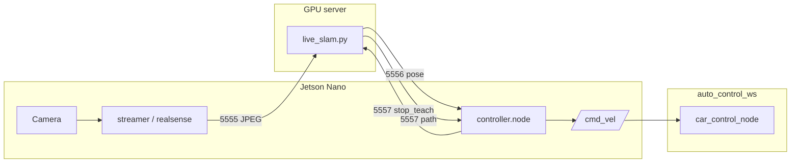

# droideka

Autonomous RC car: **teach** a path by driving manually, then **follow** it using
DROID-SLAM (GPU) and Pure Pursuit (Jetson Nano → `/cmd_vel`).

Low-level drive control lives in a separate ROS 2 workspace:
[auto_control_ws](https://github.com/krisztiancsuta/auto_control_ws).

## System overview

| Node | Hardware | Role |
|------|----------|------|
| **nano_client** | Jetson Nano | Camera → ZMQ; Pure Pursuit; publishes `/cmd_vel` |
| **gpu_server** | Linux + CUDA | DROID-SLAM, path build, live pose stream |
| **auto_control_ws** | Nano (ROS 2) | Subscribes `/cmd_vel`, drives servo + ESC |



**SLAM session states**

| State | Behaviour |
|-------|-----------|
| `TEACH` | Track and buffer keyframes (default at startup). |
| `AUTONOMOUS` | Publish rear-axle pose each frame after `stop_teach`. |

`stop_teach` builds the path from buffered poses, returns `(N, 3)` `[x, y, θ]`, and
switches to `AUTONOMOUS` in the same session (no re-localisation).

**Frames:** 2D ground plane = SLAM **X–Z**; `θ = atan2(forward_z, forward_x)`;
SI units (m, s, rad). Camera→rear-axle offset is applied on the GPU before publish.

## Hardware

- **Camera:** Intel RealSense D435i (RGB for SLAM).
- **Vehicle:** HPI Trophy Buggy Flux #107016 — 320 mm wheelbase, ±30° steer
  ([`nano_client/controller/config.py`](nano_client/controller/config.py)).
- **Compute:** Jetson Nano (client) + x86 GPU box (DROID-SLAM).

## Repository layout

```
droideka/
├── gpu_server/droideka_src/
│   ├── live_slam.py              # ZMQ state machine + DROID-SLAM
│   ├── path_from_reconstruction.py
│   ├── pure_pursuit.py           # Offline replay helpers
│   └── export_ply.py
├── nano_client/
│   ├── streamer.py               # USB camera → ZMQ
│   ├── realsense_streamer.py     # D435i + intrinsics on wire
│   ├── bag_streamer.py           # .bag replay
│   ├── zmq_video_sender.py       # Image sequence / JPEG folder replay
│   ├── extract_bag_frames.py     # .bag → JPEG folder (offline)
│   └── controller/               # Pure Pursuit + rclpy node
├── CHEATSHEET.md                 # Step-by-step live-test commands
└── README.md
```

## Quick start

Set on the GPU host (adjust paths):

```bash
export DROID_SLAM_ROOT=$HOME/DROID-SLAM
export DROID_SLAM_WEIGHTS=$DROID_SLAM_ROOT/droid.pth
```

Replace `<gpu>` with the GPU server IP.

**1. GPU — SLAM server**

```bash
cd gpu_server
python -m droideka_src.live_slam
```

**2. Nano — vehicle I/O** (from `auto_control_ws`):

```bash
ros2 run car_control car_control_node
```

**3. Nano — stream camera while teaching**

```bash
python nano_client/streamer.py --server-ip <gpu>
# or: realsense_streamer.py, bag_streamer.py, zmq_video_sender.py
```

**4. Nano — autonomous follow**

```bash
python -m nano_client.controller.node --gpu-host <gpu>
```

Full terminal order, intrinsics, bag replay, and pre-flight checks:
[`CHEATSHEET.md`](CHEATSHEET.md).

Telemetry per run: `nano_client/runs/<timestamp>/` (`path_taught.npy`, `meta.json`,
`autonomy.jsonl`) — ignored by git.

## Dependencies

**GPU:** Python 3, PyTorch + CUDA, `lietorch`, `droid_backends`, `numpy`,
`opencv-python`, `open3d`, `pyzmq`. Install [DROID-SLAM](https://github.com/princeton-vl/DROID-SLAM)
locally (`gpu_server/DROID-SLAM/` is gitignored).

**Nano:** Python 3, `numpy`, `opencv-python`, `pyzmq`, ROS 2 **Humble** for
`controller.node`. `auto_control_ws` built separately on the Nano.

## ZeroMQ ports

| Port | Pattern | Payload |
|------|---------|---------|
| 5555 | PULL | JPEG, or `[json intrinsics, jpeg]` |
| 5556 | PUB | `{"x","y","theta","frame_id","t_ns"}` rear-axle pose |
| 5557 | REP | `{"cmd":"stop_teach"}` → path buffer + meta; `{"cmd":"ping"}` |

Default image size on the wire: **960×288** (must match `live_slam.py --image_size`).

Intrinsics: sent by `realsense_streamer.py` / `bag_streamer.py`, or via
`--intrinsics-json` / `DROIDEKA_INTRINSICS_JSON` when using plain `streamer.py`.

## Configuration

Vehicle parameters: [`nano_client/controller/config.py`](nano_client/controller/config.py)
(`VehicleConfig`). Override with JSON:

```bash
python -m nano_client.controller.node --gpu-host <gpu> --config my_car.json
```

Example: `wheelbase` 0.32, `target_v` 0.3, `max_steer_rad` 0.524, `goal_tolerance_m` 0.20.

## Data hygiene

Large artefacts (weights, `.bag`, `.ply`, `.npy`, images, `runs/`, `bag_frames/`,
local `docs/` and `documentation/`) stay out of git via [`.gitignore`](.gitignore).

## References

- Coulter (1992), *Pure Pursuit Path Tracking* — CMU-RI-TR-92-01.
- Teed & Deng (2021), *DROID-SLAM*.
- [auto_control_ws](https://github.com/krisztiancsuta/auto_control_ws#readme).
